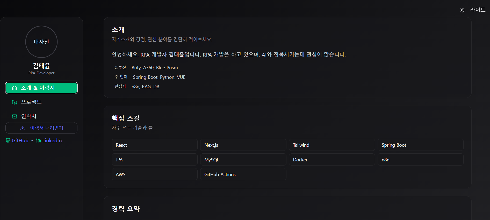

# 📄 My Online Resume

React + TypeScript + TailwindCSS로 제작한 **온라인 이력서**입니다.  
심플하고 직관적인 디자인으로, 저의 경력·기술·프로젝트를 한눈에 확인할 수 있도록 구성했습니다.

---

## 🖥 주요 기능
- 🌗 **다크 / 라이트 모드** 지원  
- 📱 **반응형 디자인** (PC · 모바일 모두 최적화)  
- 🧾 **소개 / 핵심 스킬 / 경력 / 프로젝트** 정보 제공  
- 🎨 TailwindCSS + shadcn/ui 기반의 **모던 UI**  

---

## 🛠 기술 스택
| 분류 | 사용 기술 |
|------|-----------|
| **Frontend** | React, TypeScript, TailwindCSS, shadcn/ui |
| **빌드 툴** | Vite |
| **버전 관리** | Git, GitHub |

---

## 📸 미리보기

  

---

## 📬 연락하기
- **Email**: lala9663@naver.com  
- **GitHub**: [@lala9663](https://github.com/lala9663)

---